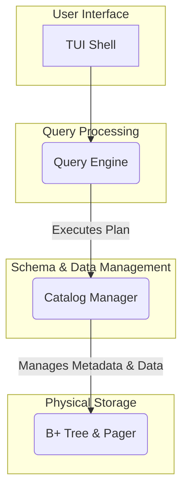

# 🚀 QoreDB: An Educational SQL Database Engine


A lightweight, educational SQL database engine built from scratch in C#. This project is a deep dive into the core components of a relational database, including a query parser, an execution engine, and a B+ Tree-based storage layer.

---

## 📚 Documentation

**For a complete guide to the architecture, API, and usage, please visit the [official documentation](https://f0xedb.github.io/QoreDB).**

The documentation is generated using **DocFX** and provides a detailed look into the internals of QoreDB.

---

## ✨ Features

* **Interactive TUI Shell**: A user-friendly terminal interface powered by **Spectre.Console**, featuring command history, readline support, and formatted query results.
* **Custom SQL Parser**: A robust, case-insensitive SQL parser built with **ANTLR** that transforms raw SQL into an Abstract Syntax Tree (AST).
* **Extensible Query Engine**: An extensible query execution engine built on the **Iterator (Volcano) model**, making it easy to add new SQL features and operators.
* **B+ Tree Storage Engine**: A persistent, page-based storage engine featuring a B+ Tree implementation for efficient indexing and data retrieval.
* **System Catalog**: Manages all schema information (tables and columns) within the database.
* **Meta-Commands**: The TUI supports special commands for database management, such as `\dt` to list tables and `\d <table>` to describe a table's schema.
* **Supported SQL Operations**:
    * `CREATE TABLE`
    * `DROP TABLE`
    * `INSERT INTO`
    * `SELECT` (with `*`, `WHERE`, and `ORDER BY` clauses)

## 🛠️ Technology Stack

* **Language**: C# 12
* **Framework**: .NET 9
* **Parser Generator**: ANTLR4
* **TUI Framework**: Spectre.Console
* **Testing**: NUnit, Moq, FluentAssertions

## 🏛️ Architecture Overview

QoreDB is designed with a clean separation of concerns, broken down into four distinct layers.



1.  **TUI (Terminal User Interface)**: The entry point for users. It provides an interactive shell for writing SQL and viewing results.
2.  **Query Engine**: The brain of the database. It uses ANTLR to parse SQL into an operator tree (AST) and then executes that plan.
3.  **Catalog Manager**: Manages all database metadata. It knows where tables are, what columns they have, and what their data types are.
4.  **Storage Engine**: The lowest level, responsible for reading and writing data to and from the disk (or memory). It uses a pager to manage memory and a B+ Tree for indexing.

## 🏁 Getting Started

### Prerequisites

* .NET 9 SDK
* Java Runtime Environment (for ANTLR code generation)

### Installation & Running

1.  **Clone the repository:**
    ```bash
    git clone https://github.com/F0xedb/QoreDB.git
    cd QoreDB
    ```

2.  **Build the solution:**
    *This will also trigger the ANTLR code generation.*
    ```bash
    dotnet build
    ```

3.  **Run the TUI:**
    ```bash
    dotnet run --project QoreDB.Tui/QoreDB.Tui.csproj
    ```

## 💻 Usage

Once the TUI is running, you can interact with the database using SQL commands and special meta-commands.

### SQL Commands

```sql
-- Create a new table
CREATE TABLE Employees (Id INT, Name STRING, City STRING);

-- Insert some data
INSERT INTO Employees (Id, Name, City) VALUES (1, 'Alice', 'Seattle');
INSERT INTO Employees (Id, Name, City) VALUES (2, 'Bob', 'New York');

-- Query the data
SELECT Name FROM Employees WHERE City = 'Seattle' ORDER BY Name;
```

### Meta-Commands

* `\help` or `\?`: Displays the help message.
* `\dt`: Lists all tables in the database.
* `\d <table>`: Describes the columns of a specific table.
* `\import <file>`: Executes SQL statements from a file.
* `\q` or `\exit`: Exits the shell.

## 🤝 Contributing

This is an educational project, and contributions are welcome! Whether it's fixing a bug, adding a new SQL feature, or improving the documentation, feel free to open an issue or submit a pull request.

1.  Fork the repository.
2.  Create a new branch (`git checkout -b feature/AmazingFeature`).
3.  Commit your changes (`git commit -m 'Add some AmazingFeature'`).
4.  Push to the branch (`git push origin feature/AmazingFeature`).
5.  Open a Pull Request.

## 📜 License

This project is licensed under the MIT License.

Copyright (c) 2025 Tom Meyers