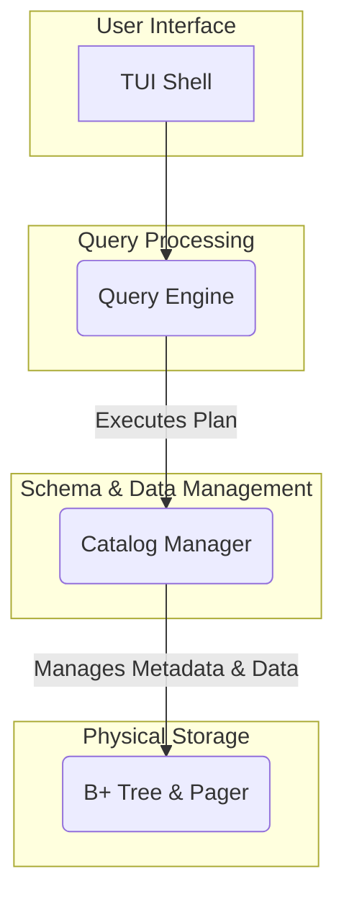

# QoreDB Architecture

QoreDB is designed with a layered architecture, promoting a clean separation of concerns. This modular design makes the system easier to understand, maintain, and extend. The architecture is divided into four main layers.

## 1. TUI (Terminal User Interface)

The TUI is the outermost layer and the primary entry point for users. It provides an interactive command-line shell for executing SQL queries and managing the database.

- **Powered by Spectre.Console**: For a rich and user-friendly terminal experience.
- **Features**: Command history, readline support, and formatted table output.
- **Responsibilities**:
    - Reading user input.
    - Sending SQL queries to the Query Engine.
    - Displaying results to the user.
    - Handling meta-commands (e.g., `\dt`, `\d`, `\help`).

## 2. Query Engine

The Query Engine is the core of the database, responsible for processing SQL queries. It's a complex layer with several sub-components.

- **SQL Parser**:
    - **ANTLR-based**: Uses the ANTLR parser generator to transform raw SQL into an Abstract Syntax Tree (AST).
    - **Case-Insensitive**: The parser is designed to be case-insensitive for SQL keywords.
- **Query Optimizer**:
    - **Rule-Based**: Applies a set of optimization rules (e.g., predicate pushdown) to the AST to create a more efficient execution plan.
- **Execution Engine**:
    - **Iterator (Volcano) Model**: Executes the optimized plan using the iterator model, where each operator in the plan is an iterator that pulls data from its children.
    - **Extensible**: This model makes it easy to add new SQL operators and features.

## 3. Catalog Manager

The Catalog Manager, also known as the system catalog, is responsible for managing all the metadata of the database.

- **Responsibilities**:
    - Storing and retrieving schema information (tables, columns, data types).
    - Managing the physical location of tables in the storage engine.
    - Providing the Query Engine with the metadata it needs to parse and execute queries.

## 4. Storage Engine

The Storage Engine is the lowest layer, handling the physical storage of data on disk (or in memory).

- **Page-Based**: Manages data in fixed-size pages to optimize disk I/O.
- **Pager**: A component responsible for reading and writing pages between memory and disk, and managing a buffer pool to cache frequently accessed pages.
- **B+ Tree**:
    - **Indexing**: Uses a B+ Tree implementation for efficient indexing and data retrieval.
    - **Persistence**: Ensures that data is stored durably on disk.

This layered architecture ensures that each component has a well-defined responsibility, making the entire system more robust and easier to develop.